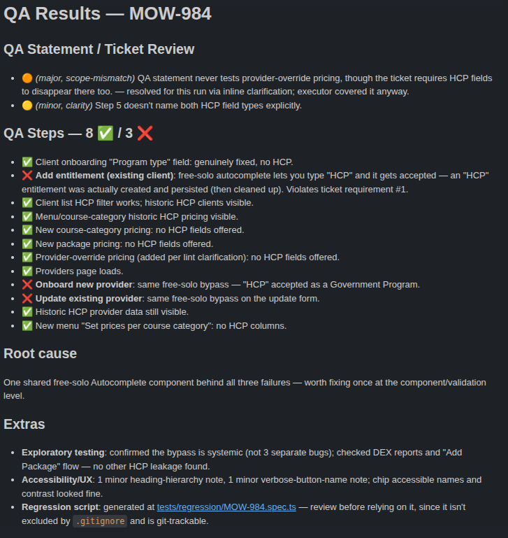

# qa-bot

Given a Jira ticket number, fetches its description and QA statement, lints the QA statement for clarity/consistency/missing context, executes it against a deployed app via Playwright MCP, and produces a results summary ready to paste into the Jira ticket.



## One-time setup

1. Install Node 18+, then run `npm install` (pulls in `@playwright/test`, used only if you opt into regression-script generation — see below).
2. Copy `.env.example` to `.env` and fill in:
   - `JIRA_EMAIL` — the email of the Jira account to query with.
   - `JIRA_API_TOKEN` — generate one at https://id.atlassian.com/manage-profile/security/api-tokens
   - Any per-project test credentials your team's `context/<PROJECT_KEY>.md` files reference (added over time, see below).
3. Edit `config/jira.config.json`:
   - Set `domain` to your real Jira Cloud domain (e.g. `yourcompany.atlassian.net`).
   - For each Jira project you'll run this against, add an entry under `projects` with either `qaStatementCustomField` (the custom field ID holding the QA statement, if your team uses one — e.g. `customfield_10050`) or `qaStatementHeading` (the heading text QA steps live under inside the description, e.g. `"QA Steps"`), or both (custom field tried first, heading used as a fallback if the field is empty).
   - Some projects don't use Jira's built-in description field at all — the ticket's real content lives in a custom field instead (e.g. a structured "Improvement Description" field). If so, set `descriptionCustomField` to that field's ID too. Find a field's ID by opening a ticket, inspecting the field's label element, and reading the `customfield_XXXXX` out of its `data-testid`.
4. In an interactive Claude Code session in this directory, run `/qa-run` once — it'll prompt to approve the project-scoped `.mcp.json` Playwright MCP server.

## Usage

```
/qa-run PROJ-123
```

This is interactive by design: if the QA statement is missing context the tool can't infer (deployment URL, login, test data), it'll ask you and save the answer to `context/PROJ.md` so future tickets in the same project don't need to ask again. Commit that file (it's git-tracked) so the whole team shares the same context — never put actual secret values in it, only the *name* of the `.env` variable that holds the secret.

A second file, `context/PROJ.app-notes.md`, builds up automatically alongside it — a knowledge base of *how to drive this app's UI* (navigation paths, form quirks, reliable selectors) that `qa-executor` writes and revises itself after every run, with no prompting needed. It's advisory: if the app's UI has moved on since the notes were written, that's expected and not treated as a bug — the executor just adapts and corrects the file. Commit it too so the whole team benefits from what past runs learned.

Output lands in `runs/<TICKET-KEY>-<timestamp>/summary.md`, plus any failure screenshots alongside it in `screenshots/`. Nothing is posted back to Jira automatically — copy the summary into the ticket yourself.

Early on it also asks about optional extras (any combination, or none):
- **A Playwright regression script** — a reusable `@playwright/test` spec covering this run's automated steps, written to `tests/regression/<TICKET-KEY>.spec.ts`. Unlike everything under `runs/`, this is git-tracked — review it before committing. Credentials/URLs are referenced by env var name (via `scripts/load-env.mjs`), never hardcoded. Re-run it any time with `npm run test:regression` (or `npx playwright test --config=playwright.regression.config.ts tests/regression/<TICKET-KEY>.spec.ts` for just one).
- **Additional exploratory testing** — a bounded pass of extra checks around the feature (edge cases, error states, adjacent UI) beyond what the ticket's QA statement explicitly asks for, reported in its own section of `summary.md`.
- **Accessibility/UX testing** — a bounded, heuristic pass (accessible names/labels, heading structure, keyboard/focus handling, ARIA correctness, obvious UX friction) over the pages/flows the QA statement touched, also reported in its own section of `summary.md`. Not a substitute for a real accessibility audit.

## How it fits together

- `scripts/jira-fetch.mjs` — deterministic Jira REST API client; extracts description + QA statement.
- `scripts/adf-to-md.mjs` — converts Jira's Atlassian Document Format to Markdown.
- `.claude/agents/qa-linter.md` — subagent that reviews the QA statement for clarity, scope-consistency with the description, and missing context; severity-tags findings as `minor`/`major`/`blocking`.
- `.claude/agents/qa-executor.md` — subagent that drives Playwright MCP through the QA statement's steps against the real deployed app, screenshotting failures, and maintains `context/PROJ.app-notes.md` (its own navigation knowledge base) as it goes.
- `scripts/render-summary.mjs` — deterministic renderer that turns the linter's and executor's structured JSON output into the final Jira-paste-ready Markdown, including the accept/reject decision.
- `.claude/skills/qa-run/SKILL.md` — orchestrates all of the above, and is the only piece that talks to you directly (missing-context prompts, blocking-issue decisions).

See `/home/twj/.claude/plans/i-am-building-a-soft-thimble.md` for the full design write-up this was built from.
